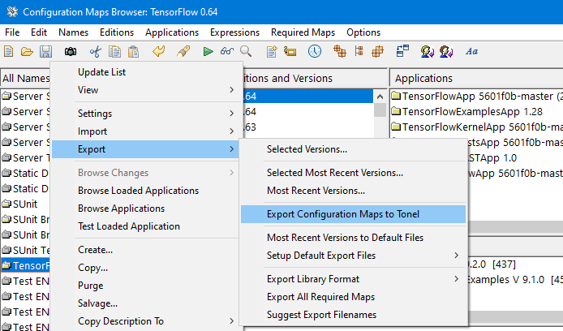
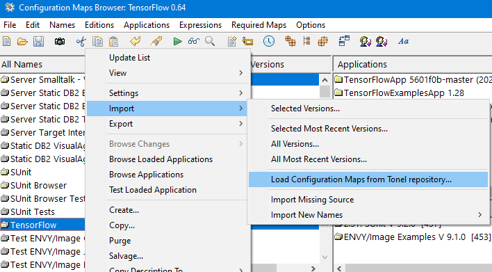

<p align="center">
 <h1 align="center">Tonel for VAST Platform (VA Smalltalk)</h1>
  <p align="center">
    Providing a git friendly file format support to VA Smalltalk
    <!---
    <br>
    <a href="docs/"><strong>Explore the docs »</strong></a>
    <br>
    -->
    <br>
    <a href="https://github.com/vasmalltalk/tonel-vast/issues/new?labels=Type%3A+Defect">Report a defect</a>
    |
    <a href="https://github.com/vasmalltalk/tonel-vast/issues/new?labels=Type%3A+Feature">Request feature</a>
  </p>
</p>


## Tonel for VAST in a Nutshell

 Supporting the [Tonel format](https://github.com/pharo-vcs/tonel) is a work in progress in VAST 9.2.1. Our implementation complies with the specification of the format. But since the specification does not take into account some important VAST specific features we extended it in a non intrusive way to make it compatible with the spec and useful to VAST users as well.

There are four main building blocks that work in layers to support Tonel in VA Smalltalk:

### Tonel Parser
Parses the Tonel specific files following the same rules as the [canonical version](https://github.com/pharo-vcs/tonel).

### Tonel Reader
Relies on the parser to create first-class objects representing each abstraction from Tonel. E.g. _Package_, _Class_, _Method Definition_, _Method Extension_

### Tonel Loader
Uses the reader to compile classes, methods, extensions, etc. and then create the required editions and versions in the ENVY Library.

### Tonel Writer
Writes to disk, in a Tonel compatible format (plus the VAST specific features described below) the Applications, SubApplications, Classes, Shared Pools, Methods, Extensions, etc.

If the Application has a class side `#tonelPackageName` selector it  will then honor it when creating the package name.


## Purpose
For [Instantiations](https://www.instantiations.com/) and VA Smalltalk, having git support is a priority. The first step is to have a plain text file-based output and input for the sources of its Applications.

[Tonel](https://github.com/pharo-vcs/tonel) is the current file format widely accepted by the Smalltalk community to store source code on disk with a VCS-friendly format.

## License
- The code is licensed under [MIT](LICENSE).
- The documentation is licensed under [CC BY-SA 4.0](http://creativecommons.org/licenses/by-sa/4.0/).


## Installation

- Download [VAST 9.2.1 or newer from Instantiations](https://www.instantiations.com/products/vasmalltalk/download.html).
- Clone this repository.
- From the Configuration Map Browser, do an `Import` -> `All Most Recent Versions...` -> and select the `envy/Tonel.dat` located in the root folder of your local repository clone.
- Select the map `Tonel` (and optionally `Test Tonel` if you want to run its SUnit tests) and do a `Load With Required Maps` the latest version of it.
- Optionally run the SUnit tests included in the map `Test Tonel` to ensure correct installation. One easy way is to right-click on the `Test Tonel` map name in the Name pane (as opposed to version pane ) and then select `Test Loaded Applications`.
- Explore the [documentation](docs/).

## Quick Start

### Using GUI menus

#### Applications

You can load individual Tonel packages as Applications or export VAST Applications as Tonel packages via Application Manager's `Import/Export`.


When loading apps using this GUI the _loader_ will attempt to detect whether the files are in a Git repository, and if a git repository is detected it will configure itself to use [git versioning](docs/strategies.md), otherwise it will use the default settings (or leave all editions open without version).

#### Configuration Maps

You can also export and load Configuration Maps together with their applications from the Configuration Maps Browser.

##### Exporting

Select the Configuration Maps you want to export in the names list, and then open the contextual menu and choose `Export`, and then `Export Configuration Maps to Tonel`.



This will ask you which version of the config maps you want to export (only one version per map is allowed), where do you want to store it, as well as a few other settings.

##### Loading

To load a Configuration Map in a Tonel repository into VAST, you have to choose the `Import` option in the names list, and then `Load Configuration Maps from Tonel...`.



Once you select the available Configuration Maps, they will be loaded together with their required maps. If a required map is within the Tonel repository, then this map version will take precedence over the version specified.


### Programmatically

As with the GUI options, you can also export independent Applications or whole Configuration Maps to Tonel.

#### Applications

```smalltalk
"Exporting to Tonel"
TonelWriter new
  clearSourcesDirectory; "deletes everything in the target directory"
  writeProjectIncluding: (Array with: MyAppCore)
  into: (CfsPath named: 'my-tonel-demos').
 ```

```smalltalk
"Loading from Tonel"
(TonelLoader readFromPath (CfsPath named: 'my-tonel-demos'))
  loadApplicationNamed: 'MyAppCore'.

"or you can load by Tonel package name"
(TonelLoader readFromPath (CfsPath named: 'my-tonel-demos'))
  loadApplicationsForPackagesNamed: #('MyApp-Core' 'MyApp-Tests').
```

#### Configuration Maps

```smalltalk
"Exporting to Tonel"
TonelWriter new
  addLatestConfigurationMapNamed: 'My Tonel Demo';
  addLatestConfigurationMapNamed: 'My Tonel Demo Tests';
  addApplicationsFromConfigurationMaps;
  writeProjectInto: (CfsPath named: 'my-tonel-demos').
```
```smalltalk
"Loading from Tonel"
(TonelLoader readFromPath: (CfsPath named: 'my-tonel-demos')) loadAllMapsWithRequiredMaps.
```

#### More options

You can specify other options like versioning, prerequisite resolution, and others using the different strategies for each case, read the [strategies documentation](docs/strategies.md) to learn more about them.


## VAST specific features

Below we list the specific features of VAST and how they're handled.

### Multiple method categories

Since VAST supports multiple categories per method (not just one), when writing Tonel from VAST if the method has more than one category in addition to the `#category` property containing a single category name, we add a custom `#vaCategories` property to the method definition metadata whose value is an array of category names.

This way, when loading methods from source code, single method categories dialects will read only the `#category` property and the VAST Tonel loader will look for the `vaCategories` (if available).

### Private and Public methods

In VAST method visibility is not a simple category convention but a boolean property of the method itself, so methods can be treated as `private` or `public` and the tools will accommodate to this accordingly.

To support this feature we added a `#vaVisibility` property to the method definition metadata whose value is a string containing either `public` or `private` values.

When reading code if this property is not present, the method will use `public` visibility by default.


### Application prerequisites

VAST Applications have prerequisites, that are the dependencies on other applications. Such concept is absent from the Tonel spec that only has the concept of _Package_ and dependency is managed elsewhere.

We fulfill this need by adding a custom property named  `#vaPrerequisites` to the package definition file (`.package`) whose value is an array containing the names of the prerequisites.


### Application and SubApplication hierarchy

VAST Applications can contain SubApplications, and these SubApplications can contain other SubApplications forming a composition tree, each node in the hierarchy conditioning the load of the sub applications to some condition (aka _config expression_, more on this later).

Such hierarchy of composition concept is not considered by the original Tonel spec, and for Tonel everything is just a _Package_ on a flat level.

To work around this we map each _Application_ or _Subapplication_ to a _Package_ and write them at the same flat level, also adding VAST specific properties to the package metadata definition. In addition, since the composition depends on some _config expression_ (a Smalltalk expression that returns a boolean) we store the expression and the SubApplications it would load as as a `#vaSubapplications` property as follows:

 ```smalltalk
#vaSubApplications : [
  	{
		    #condition : '(System subsystemType: #OS) = ''WIN32s''',
		    #subapps : [
     		'SomeWindowsSpecificApp'
	    ]
   }
 	]
 ```

For the most cases the config expression is just `true` meaning the sub applications will always load.

 ```smalltalk
#vaSubApplications : [
  {
		  #condition : 'true',
		  #subapps : [
			   'TonelExampleAnotherSubSubApp',
			   'TonelExampleSubSubApp'
		  ]
  }
]
 ```

Also, in the case of _SubApplications_ they will contain the name of parent _Application_ or _SubApplication_ using the property `#vaParent`, whose value will be the name of the _Application_ or _SubApplication_ in VAST and the name of the Tonel _Package_.
'TonelExampleApp'.

So extending our example above for the [sample subapp](https://github.com/vasmalltalk/tonel-demos/blob/master/source/TonelExampleSubApp/package.st)

 ```smalltalk
#vaParent: 'TonelExampleApp',
#vaSubApplications : [
  {
		  #condition : 'true',
		  #subapps : [
			   'TonelExampleAnotherSubSubApp',
			   'TonelExampleSubSubApp'
		  ]
  }
]
 ```

### Shadow SubApplications Limitation

When an _Application_ or _SubApplication_ has different branches of SubApplications based on different _config expressions_ the SubApplications in the branch that is not loaded in the image are called _shadow_ SubApplications. The typical example is some OS-specific features that are loaded based on the OS in which the image is running (e.g. UNIX vs Windows).

The current implementation of Tonel Writer for VAST fully supports writing the conditions and SubApplications to disk, but the Tonel Loader will only compile and create editions for the applications whose _config expressions_ are _valid_ (it is, that evaluates to _true_).

So if you now write an existing _Application_ with shadow _SubApplications_ they will be written to disk, but once you load them back, the shadowed ones will not be loaded (and hence not versioned in the ENVY Library).


## Compatibility Recommendations

If you want to make your code fully compatible and interoperable with other Smalltalk dialects there is a specific document with the [recommendations for compatibility](docs/compatibility.md).

## Shared Pools

VAST's way of declaring and/or initializing Shared Pools is different from other Smalltalk dialects, and to explain how this work with Tonel, there is a specific document explaining [how VAST Tonel handles shared pools](docs/sharedpools.md).


## Versioning and prerequisites

Read the [versioning, prerequisites and base editions strategies documentation](docs/strategies.md) to learn how to configure the loader to work interactively, unattended, read the version from a git repository, etc.

## Configuration Maps

Although dependency management is outside of the scope of Tonel, VA Smalltalk's Tonel tools provide a way to write them to disk and later read and load them.

Read the [Configuration Maps documentation](docs/configmaps.md) to learn how to use it.


## Examples and Demos
There is a [whole Github project](https://github.com/vasmalltalk/tonel-demos/) that contains demos about Tonel integration with VA Smalltalk.

## Roadmap / Next steps

See the [roadmap document](docs/roadmap.md) for further details.


## Acknowledgments

- [Mercap Software](https://github.com/Mercap) for their first draft on the Tonel writer
- Github repository layout was generated with [Ba-St Github-setup project](https://github.com/ba-st/GitHub-setup).

## Contributing

Check the [Contribution Guidelines](docs/CONTRIBUTING.md)
